# :ear: VODA  
**V oice-**   
**O ver**   
**D iverse**   
**A ssistance**  

      

## 프로젝트 개요  
SSAFY 9기 2학기 공통 프로젝트
   
2023.07.04 ~ 2023.08.18(7주)

### 기획 배경
시각장애인이 웹서비스 사용에 있어서 비장애인과 비교하여 불편함이 많음.
- 웹페이지에 있는 많은 컴포넌트로 인해 정보인지의 어려움
- 스크린리더기로 인식이 안되는 웹서비스 또는 이미지의 경우 정보 획득 불가

기존 서비스
- 설리반+ : 사진을 찍어서 이미지 분석
- BeMyEyes : 봉사자와 랜덤 매칭 영상통화

**VODA -> 실시간으로 지인과 영상통화**   
  

## :heart: 역할

|  |  Part | Detail |
| --- | --- | --- |
| 고세훈 | FE | 백/ AI |
| 김민재 | PM & AI | 프로젝트 관리 / third-party api 적용, 색상 & 객체 인식 모델 적용 |
| 김지원 | BE | AI |
| 나건 | BE | FE |
| 윤선희 | BE | FE |
| 최규헌 | BE | FE |
 

## 기술 스택

### Front
- React
- Redux

### Back
- Spring Boot
- JPA
- MySql

### AI Model
- TF; Face-api.js
- Flask
- OpenCV(k-means clustering & k-NN algorithm)
- Yolo V5

### Infra
- AWS EC2
- Nginx
- Docker

## 환경 설정  

- [바로가기](./exec/포팅메뉴얼.md)  

## 서비스 소개  

- 회원 관리  
**회원가입**  
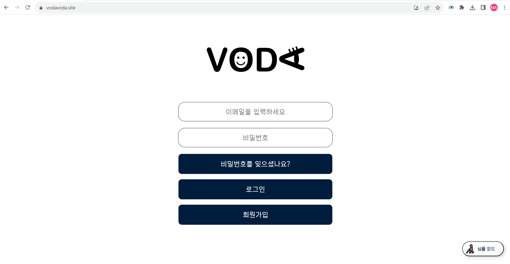  

**비밀번호 변경 및 정보수정**  
  

**임시 비밀번호 발급**  
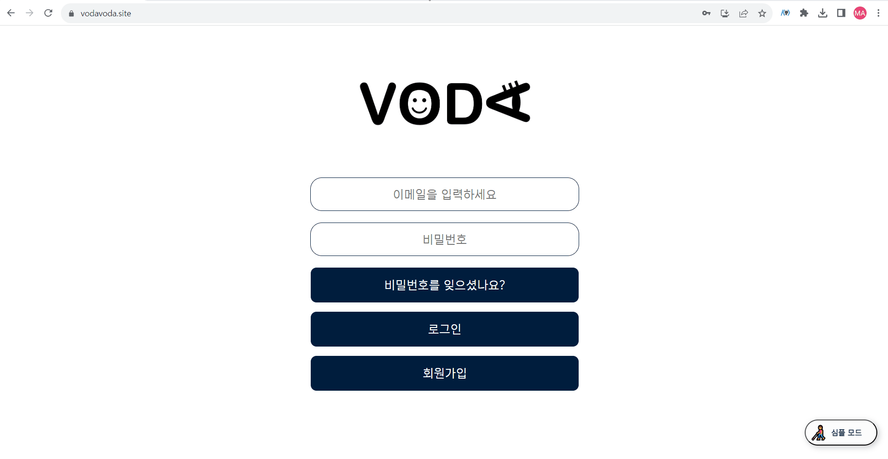  

**환경설정**  
  

**로그인**  
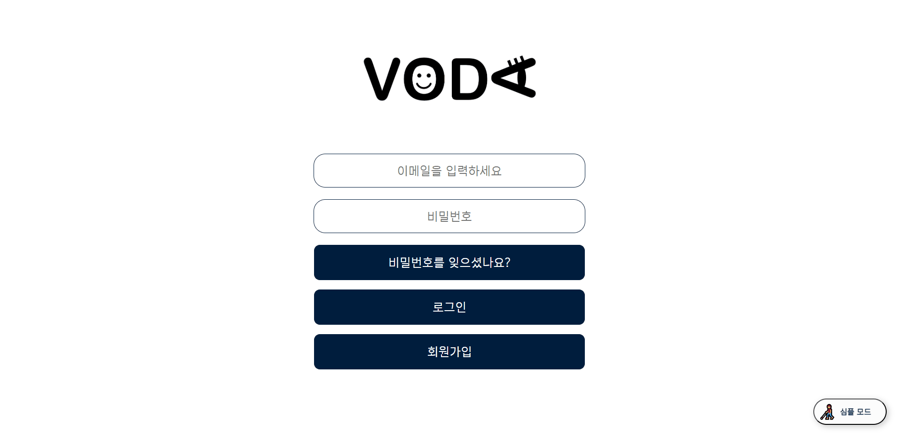  

- 고객의 소리함
**고객의소리함 목록 및 상세보기**  
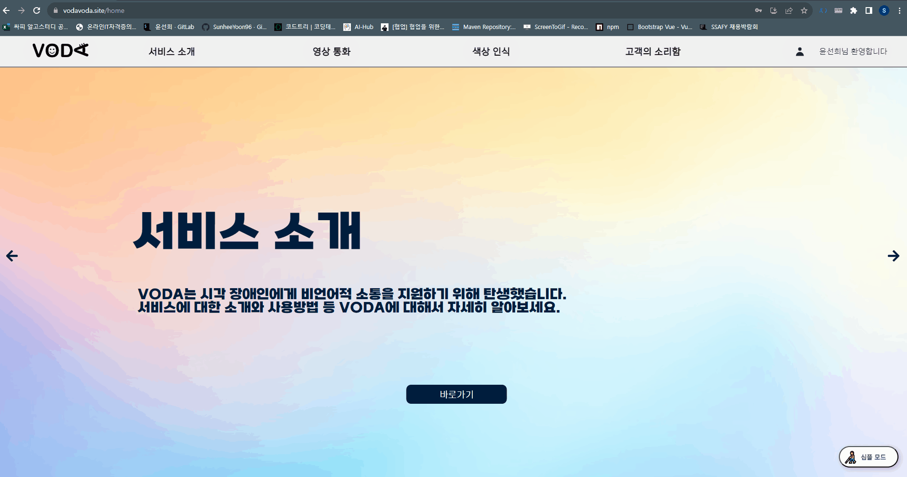  

**고객의소리함 글 작성**  
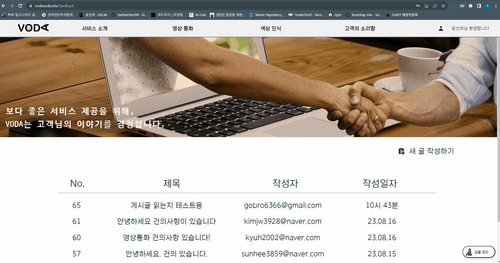  

**고객의소리함 글 수정 및 삭제**  
  

**고객의소리함 댓글 작성**  
  

- 화면 모드
**화면 모드 토글로 변경**  
  

- 영상 통화
**친구검색 및 추가**  
  

**통화 알림**  
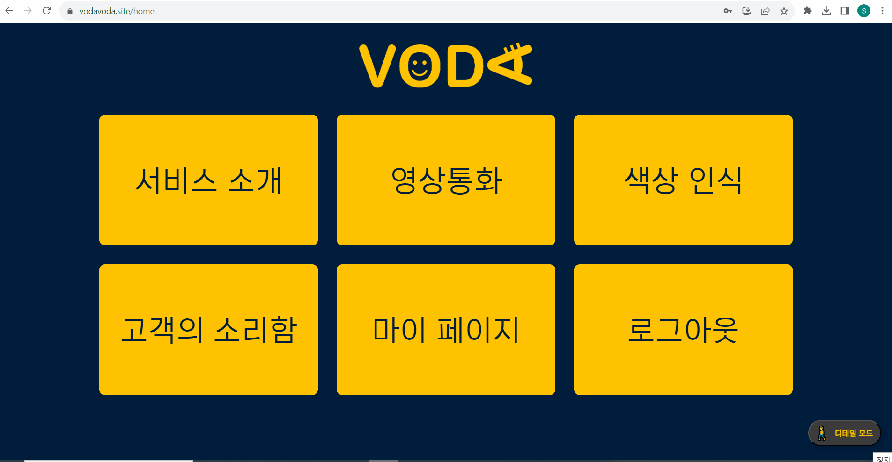  

- 표정 인식
**표정 듣기**  
  

**표정 보내기**  
  

- 색상 인식
**색상인식**  
   

## 프로젝트 산출물
### DB ERD
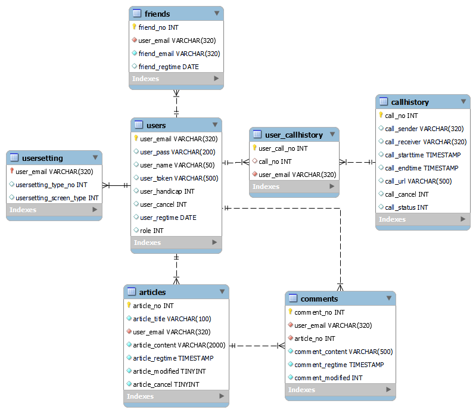  

### 요구사항 명세서
  

### API명세서
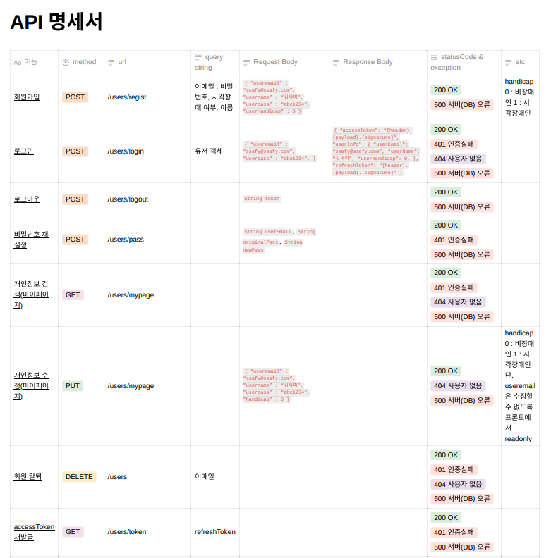  
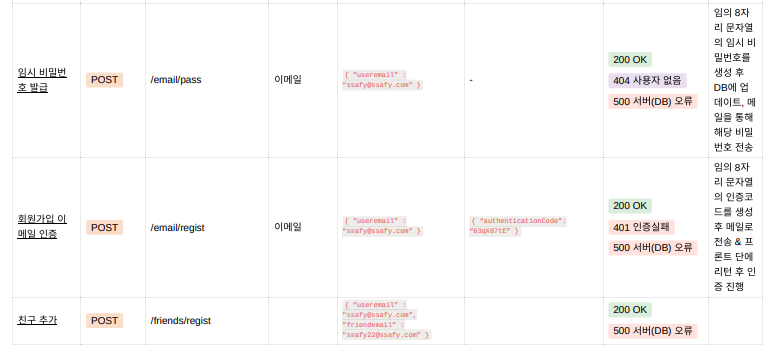  
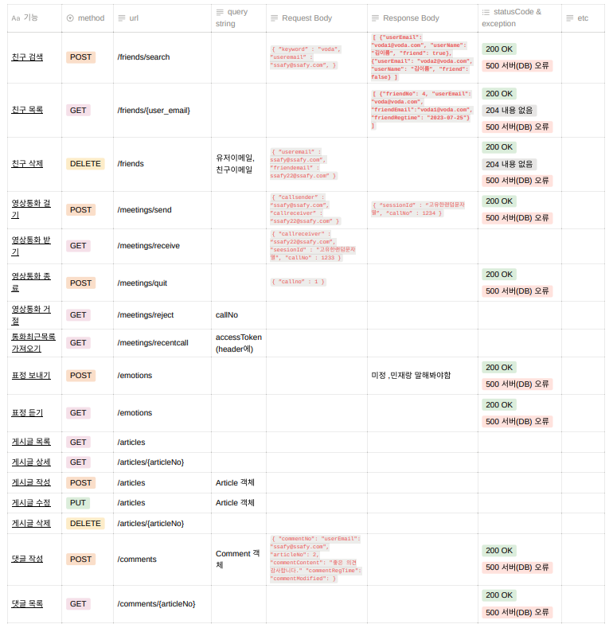  
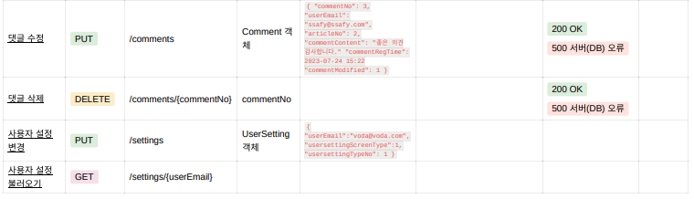  

### 아키텍쳐 다이어그램
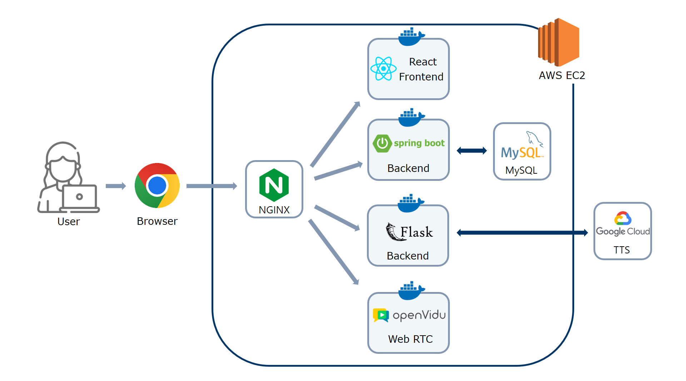  

## 느낀 점(소감)

- 고세훈  
  - 실제 시각 장애인의 입장을 고려하기 위해 안대를 쓰고 사용해보며 진정한 의미의 UX가 뭔지 정말 고민해보고 생각하며 접근성과 컴포넌트 배치 등을 생각하며 개발할 수 있던 귀중한 경험이었습니다. 협업의 시너지가 어느 것인지도 배웠고, 훌륭한 팀원들을 만나 결과물이 잘 나온 것 같아 만족했던 프로젝트였습니다.

- 김민재  

- 김지원  

- 나건  

- 윤선희  
  - 실제 사용자의 피드백을 받아가며 서비스를 개발해나가는 소중한 경험이었습니다. 또한 배포를 통해서 저희 서비스의 아키택처에 대해서 깊게 고민할 수 있는 시간이어서 좋았습니다. 7주간의 짧은 개발 기간동안 탄탄한 팀워크로 좋은 결과물을 낼 수 있어서 팀원들에게 감사하다는 말을 전하고 싶습니다.

- 최규헌  
  - 우선 프로젝트 주제에 대해서 모든 팀원이 깊게 고민하고 먼저 생각하면서 진행했기 때문에 단순 프로젝트를 위한 프로젝트가 아닌 실제 서비스를 개발하고 있다는 생각이 들어 뜻 깊었습니다. 개인적인 수확으로는 Spring Boot, JPA, React에 대한 숙련도를 쌓을 수 있었고 실제 코딩을 많이 해본 것이 도움이 많이 될 것 같습니다. 또한 다른 사람에게 내가 맡지 않은 부분을 오롯이 맡겨본 경험이 이번이 처음 일만큼 팀원들이 믿음직스럽고 개발외적인 팀워크도 잘 맞았어서 좋은 인연을 맺은 것 같습니다. VODA팀 다들 고생했어!!

## 버전 관리

- ver1.0.0
  - 버전 관리
  - 컴포넌트 추가

- ver1.0.1
  - Openvidu 라이브러리 추가
  - tensorflow의 Face-api.js 적용

- ver1.0.2
  - 영상 통화 관련 내용 추가(알림 등)
  - 친구 기능들 추가
  - 사용자 인증 인가 (Redux 적용)
  - 최근 통화 목록 조회

- ver1.0.3
  - flask 서버 연결
  - 색상 인식 모델 추가

- ver1.0.4
  - Yolo V5로 학습시킨 화장품 모델 인식 추가

